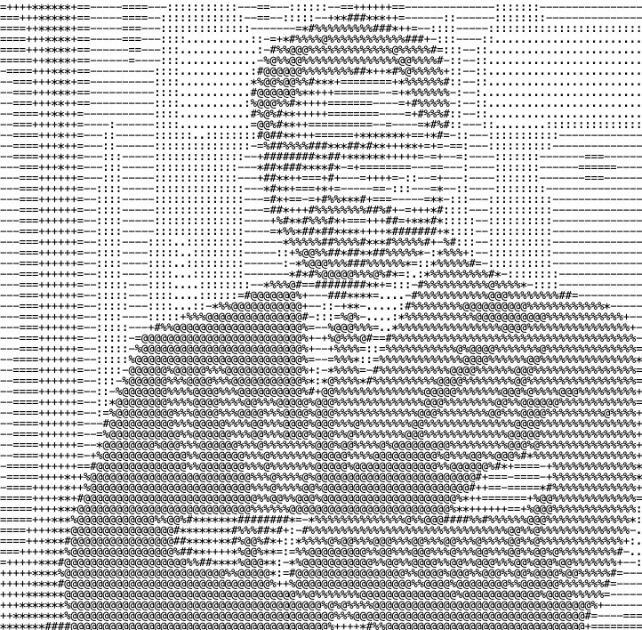

<table align="center">

<tr>

<td width="38%">



</td>

<td width="62%">

```bash
kunj@workstation:~$ open case_file.txt
━━━━━━━━━━━━━━━━━━━━━━━━━━━━━━━━━━━━━━━━━━━━━━
CASE ID        : SDE-001
STATUS         : IN PROGRESS
CLASSIFICATION : Software Engineer
NAME           : Kunj Maheshwari
ALIAS          : The Code Architect
AGE            : 23
LOCATION       : India
CURRENT ROLE   : Programmer Analyst Trainee
ORGANIZATION   : Cognizant
MISSION LOG :
 > Solving complex DSA challenges
 > Building scalable full-stack applications
 > Automating repetitive workflows
 > Designing AI-powered solutions
 > Preparing for FAANG interviews
━━━━━━━━━━━━━━━━━━━━━━━━━━━━━━━━━━━━━━━━━━━━━━
```

</td>

</table>

---

<table>

<tr>

```bash
kunj@workstation:~$ nmap -sV skills/
━━━━━━━━━━━━━━━━━━━━━━━━━━━━━━━━━━━━━━━━━━━━━━
[+] Running capability assessment...

MODULE                         STATUS
Java Development               ██████████ ACTIVE
Data Structures                █████████░░ ACTIVE
Algorithms                     █████████░░ ACTIVE
React & Next.js                █████████░░ ACTIVE
Node.js & Express              █████████░░ ACTIVE
MongoDB & SQL                  ████████░░░ ACTIVE
Selenium Automation            ██████████ ACTIVE
Playwright                     ████████░░░ ACTIVE
REST API Testing               █████████░░ ACTIVE
AI Applications                ███████░░░░ LEARNING
System Design                  ██████░░░░░ LEARNING
━━━━━━━━━━━━━━━━━━━━━━━━━━━━━━━━━━━━━━━━━━━━━━

SCAN RESULT:
> Engineering capabilities verified
> Full-stack development modules loaded
> Continuous learning mode enabled

System Status: "No limits detected. Only bigger challenges ahead."
━━━━━━━━━━━━━━━━━━━━━━━━━━━━━━━━━━━━━━━━━━━━━━
```

</td>

</table>

---

<table>

<tr>

```bash
kunj@workstation:~$ background investigation case_file.txt
━━━━━━━━━━━━━━━━━━━━━━━━━━━━━━━━━━━━━━━━━━━━━━
Initial investigation indicates the subject entered the software industry
through Quality Engineering and Test Automation.

Further surveillance revealed an unexpected evolution into
Full-Stack Development and AI Engineering.

Observed activities include:
> Solving Data Structures & Algorithms
> Building production-ready web applications
> Developing AI-powered tools
> Automating enterprise workflows
> Learning scalable system architecture

Investigators concluded the subject demonstrates exceptional curiosity,
strong problem-solving ability, and relentless commitment to growth.
━━━━━━━━━━━━━━━━━━━━━━━━━━━━━━━━━━━━━━━━━━━━━━
```

</td>

</table>

---

<table>

<tr>

```bash
kunj@workstation:~$ ls evidence/
━━━━━━━━━━━━━━━━━━━━━━━━━━━━━━━━━━━━━━━━━━━━━━
evidence
├── DSA Problems Solved
│   ├── 700+ Challenges
│   └── STATUS : VERIFIED
│
├── Full Stack Projects
│   ├── AI & Web Applications
│   └── STATUS : DEPLOYED
│
├── Automation Frameworks
│   ├── Enterprise Solutions
│   └── STATUS : PRODUCTION READY
│
└── Learning Progress
    ├── FAANG Preparation
    └── STATUS : ONGOING
━━━━━━━━━━━━━━━━━━━━━━━━━━━━━━━━━━━━━━━━━━━━━━
```

</td>

</table>

---

<table>

<tr>

```bash
kunj@workstation:~$ final report case_file.txt
━━━━━━━━━━━━━━━━━━━━━━━━━━━━━━━━━━━━━━━━━━━━━━
> CASE STATUS : ACTIVE
> Subject continues building scalable software,
> mastering algorithms, and exploring AI technologies.
> No evidence suggests the subject will stop
> learning or coding anytime soon.

Recommendation : Keep challenging with harder problems.
Risk to unresolved bugs: EXTREMELY HIGH
━━━━━━━━━━━━━━━━━━━━━━━━━━━━━━━━━━━━━━━━━━━━━━
```

</td>

</table>

---

<table>

<tr>

```bash
kunj@workstation:~$ close_case
━━━━━━━━━━━━━━━━━━━━━━━━━━━━━━━━━━━━━━━━━━━━━━
Generating report...
██████████████████████████████

Report saved successfully.
Case SDE-001 archived.

"Every bug fixed is another step toward engineering excellence."
━━━━━━━━━━━━━━━━━━━━━━━━━━━━━━━━━━━━━━━━━━━━━━
```

</td>

</table>

---

<table>

<tr>

```bash
kunj@workstation:~$ connect --available
━━━━━━━━━━━━━━━━━━━━━━━━━━━━━━━━━━━━━━━━━━━━━━
Initializing secure channels...
[✓] GitHub        : github.com/KunjMaheshwari
[✓] LinkedIn      : linkedin.com/in/kunjmaheshwari
[✓] Portfolio     : kunjmaheshwariportfoliowesbite.vercel.app
Encryption Status : ENABLED
Ready to build something amazing.
━━━━━━━━━━━━━━━━━━━━━━━━━━━━━━━━━━━━━━━━━━━━━━
```

</td>

</table>